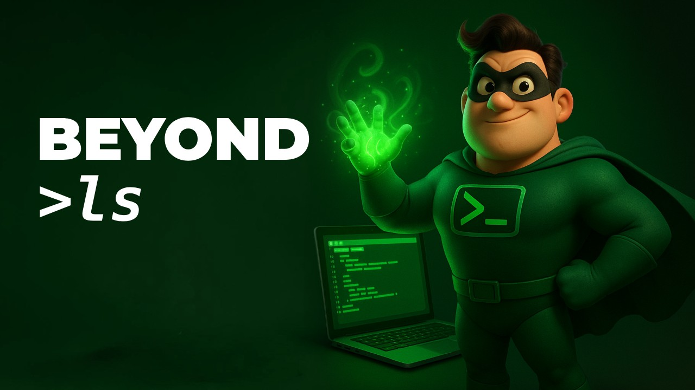

# Beyond.ls

Short [YouTube videos](https://www.youtube.com/playlist?list=PLz6-xmVUqB-8gUNjnj_k5OG0rO17M-6u5) about useful and cool command line tools, tips and tricks.

## Episode 01: [asciinema](https://www.youtube.com/watch?v=3ryOLTi0-sU)

## Episode 02: [bat](https://youtu.be/ALO9KEOkI68)

## Episode 03: [file space usage](https://www.youtube.com/watch?v=mBuz0n_leuE)

## Episode 04: [Juggling Metadata like a Pro with Exiftool](https://youtu.be/5kLpWXcXoq8)

  - [What is Metadata](./episodes/04/Metadata.jpg)

---

*Please like and subscribe to my [YouTube channel](https://www.youtube.com/@kostas_x)*
